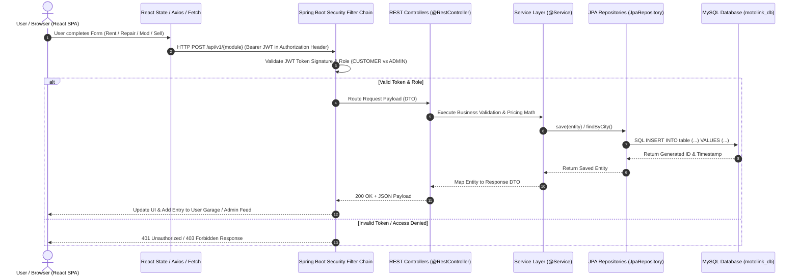

# 🚗 MotoLink - Master Technical Interview Guide & Architecture Specification

This document provides a 360-degree technical overview of **MotoLink**, an Indian Automotive Super-App built for Metro Cities. Use this guide to answer any technical or architectural question during interviews.

---

## 1. Executive Summary & Tech Stack Versions

| Component | Technology | Version | Key Purpose |
| :--- | :--- | :--- | :--- |
| **Frontend Framework** | React | `18.3.1` | Component-driven Single Page Application (SPA) |
| **Build Tool & Bundler** | Vite | `8.1.5` | Fast ESM HMR, asset bundling, and production build |
| **Styling & Design System** | Vanilla CSS3 | Standard | Custom Design Tokens (Dark Neon Automotive theme, Glassmorphism, Responsive CSS Grid) |
| **Icons Library** | Lucide React | `1.16.0` | Feather-based lightweight SVG vector icons |
| **Backend Framework** | Java Spring Boot | `3.2.2` | Enterprise RESTful API Gateway & Business Logic Services |
| **Java Runtime** | OpenJDK / JDK | `17` (LTS) | Long-Term Support Java Virtual Machine |
| **Database** | MySQL | `8.0` / `8.3` | Relational Database Management System (RDBMS) |
| **ORM Framework** | Spring Data JPA / Hibernate | `6.4.1` | Object-Relational Mapping & DDL schema auto-generation |
| **Security & Auth** | Spring Security + JJWT | `0.11.5` | Stateless JWT Bearer Token Authentication & RBAC Filter |
| **Build Automation** | Apache Maven | `3.9.x` | Java dependency management & lifecycle build pipeline |

---

## 2. End-to-End Request Flow Architecture



---

## 3. Detailed Page & Module Specification

### 1. Home Page (`HomePage.jsx`)
- **Hero Supercar Showcase**: High-resolution sports car hero display with ambient neon lighting and live Metro Hub indicator pill.
- **Service Launcher Grid**: Quick navigation cards for Rent, Repair, Modify, and Buy/Sell.
- **Popular Rentals Fleet**: Carousel highlights for Tata Nexon EV, Mahindra Thar, Hyundai Creta, Swift, and Fortuner.
- **Trust Indicators**: Verified OEM workshops, doorstep pickup guarantee, RTO verification shield.

### 2. Rent a Car Module (`RentCarPage.jsx`)
- **Functionality**: Self-drive car rental reservation across Indian metro cities.
- **Form Fields**: Pickup Metro Location, Pickup Address/Landmark, Return Metro Location, Return Address/Landmark, Pickup Date & Time, Return Date & Time.
- **Auto-Filled User Info**: Customer Full Name, Mobile (+91), Indian Driving License Number (`DL-XXXXX`).
- **Financial Calculation**: `(Daily Rate × Days) + 18% GST + Refundable Security Deposit`.

### 3. Repair Workshop Module (`RepairPage.jsx`)
- **Functionality**: Book certified workshop service appointments with doorstep pickup.
- **Form Fields**:
  - Car Company / Brand (Dropdown: Maruti Suzuki, Hyundai, Tata, Mahindra, BMW, etc.)
  - Car Model & Variant (e.g. Creta 1.5 SX, Swift ZXi)
  - Year of Manufacture & Fuel Type (Petrol / Diesel / CNG / EV)
  - Service Package (General Service ₹3,499, AC Overhaul ₹2,899, Brake Disc ₹4,200, Transmission ₹8,500)
  - Issue Details, Preferred Service Date, Time Slot
  - Doorstep Pickup Toggle (+₹499 valet pickup) & Pickup Address in Metro City.

### 4. Custom Modification Studio (`ModifyPage.jsx`)
- **Functionality**: Performance tuning & body styling inquiries.
- **Form Fields**: Vehicle Brand, Model, Mfg Year, Engine Specs/Code (e.g. 1.0L TSI / 2.0L Diesel), Package (Stage 1/2 ECU Remap, Valvetronic Exhaust, Widebody Kit, PPF Satin Wrap), Budget Bracket (`₹15k-30k`, `₹30k-75k`, `₹75k-1.5L`, `₹1.5L+`), Delivery Metro City, Phone.

### 5. Buy & Sell Marketplace (`BuySellPage.jsx`)
- **Buy Tab**: Search certified pre-owned cars with RTO codes (`MH-02`, `DL-3C`, `KA-01`), pricing in ₹ Lakhs (`₹22.50 Lakh`), owner history, and direct seller contact modal.
- **Sell Tab**: 3-step listing form (Car Company, Model, Variant, Reg Year, KM Driven, Fuel, Transmission, Ownership Count, RTO State Code, Expected Price in ₹ Lakhs, Seller Contact Number).

### 6. Contact Us Page (`ContactUsPage.jsx`)
- 24x7 Pan-India Emergency Breakdown Towing Banner (`1800-209-9000`).
- Regional Metro HQ Addresses (Gurugram, Mumbai BKC, Bengaluru UB City, Hyderabad HITEC City).
- Interactive Inquiry Form.

### 7. User Garage Dashboard (`DashboardModal.jsx`)
- **No Fake Data**: 100% real-time stateful activity feed.
- **Live User Profile**: Displays user's Name, Email, Phone, and verified Driving License Number.
- **Activity Feed**: Subtabs for Rentals (`userBookings`), Repairs (`userRepairs`), Tuning Quotes (`userMods`), and Car Listings (`userListings`).

### 8. Admin Control Center (`AdminPanelModal.jsx`)
- **Role-Gated Security**: Accessible **ONLY** when logged in with secret admin credentials (`admin@123` / `12345678`). No public buttons in header.
- **Real-Time KPIs**: Live Active Visitors, Registered Users Count, Total Submissions Count, Gross Financial Volume in `₹`.
- **Leads & Submissions Table**: Search & filter all customer form entries with phone, DL, and submitted details.
- **User Directory**: View all registered user profiles and roles.

---

## 4. Authentication, Security & JWT Mechanics

### How JWT Token Flow Works

```mermaid
graph TD
    Client[React App] -->|1. POST /api/v1/auth/login {email, password}| AuthController[Spring Security AuthController]
    AuthController -->|2. Authenticate Credentials| Manager[AuthenticationManager]
    Manager -->|3. Load UserDetails| UserDetailsService[CustomUserDetailsService]
    UserDetailsService -->|4. Verify BCrypt Password| DB[(MySQL Database)]
    Manager -->|5. Generate JWT Token| JwtProvider[JwtTokenProvider]
    JwtProvider -->|6. Sign with Secret Key + Claim Role| Token[JSON Web Token]
    Token -->|7. Return JWT in Response Header/JSON| Client
    Client -->|8. Store Token in localStorage| Storage[Browser LocalStorage]
    Client -->|9. Send 'Authorization: Bearer <token>'| ProtectedAPI[Protected REST API]
```

### Key Spring Security Components

1. **`JwtTokenProvider`**:
   - Generates JWT signed with HMAC-SHA512 algorithm using secret key (`motolink.jwt.secret`).
   - Sets Expiration Time (24 Hours / 86,400,000 ms).
   - Embeds User Role Claims (`ROLE_CUSTOMER` or `ROLE_ADMIN`).

2. **`JwtAuthenticationFilter`**:
   - Intercepts every incoming HTTP request.
   - Extracts `Bearer <token>` from the `Authorization` header.
   - Validates signature and token expiration.
   - Sets `SecurityContextHolder.getContext().setAuthentication(auth)` for Spring Security context.

3. **`SecurityConfig` (`SecurityFilterChain`)**:
   - Disables CSRF (since JWT is stateless).
   - Enables CORS for React frontend origin (`http://localhost:5173`).
   - Gates `/api/v1/admin/**` endpoints with `.hasRole('ADMIN')`.
   - Allows public endpoints (`/api/v1/auth/**`, `/api/v1/cars/**`).

---

## 5. MySQL Database Schema (`motolink_db`)

```sql
CREATE DATABASE IF NOT EXISTS motolink_db;
USE motolink_db;

-- 1. Users Table
CREATE TABLE users (
    id BIGINT AUTO_INCREMENT PRIMARY KEY,
    full_name VARCHAR(100) NOT NULL,
    email VARCHAR(100) UNIQUE NOT NULL,
    password_hash VARCHAR(255) NOT NULL,
    phone VARCHAR(15) NOT NULL,
    driving_license VARCHAR(30),
    role ENUM('CUSTOMER', 'ADMIN') DEFAULT 'CUSTOMER',
    created_at TIMESTAMP DEFAULT CURRENT_TIMESTAMP
);

-- 2. Rental Fleet Table
CREATE TABLE rental_cars (
    id BIGINT AUTO_INCREMENT PRIMARY KEY,
    make VARCHAR(50) NOT NULL,
    model VARCHAR(50) NOT NULL,
    year INT NOT NULL,
    category VARCHAR(30) NOT NULL,
    fuel_type VARCHAR(20) NOT NULL,
    transmission VARCHAR(20) NOT NULL,
    seats INT DEFAULT 5,
    price_per_day DECIMAL(10,2) NOT NULL,
    refundable_deposit DECIMAL(10,2) NOT NULL,
    metro_city VARCHAR(50) NOT NULL,
    image_url VARCHAR(500),
    is_available BOOLEAN DEFAULT TRUE
);

-- 3. Rental Bookings Table
CREATE TABLE rental_bookings (
    id VARCHAR(30) PRIMARY KEY, -- e.g. MTL-492019
    user_id BIGINT NOT NULL,
    car_name VARCHAR(100) NOT NULL,
    pickup_city VARCHAR(50) NOT NULL,
    pickup_address TEXT NOT NULL,
    drop_city VARCHAR(50) NOT NULL,
    drop_address TEXT NOT NULL,
    pickup_date VARCHAR(50) NOT NULL,
    drop_date VARCHAR(50) NOT NULL,
    total_amount DECIMAL(10,2) NOT NULL,
    status VARCHAR(30) DEFAULT 'CONFIRMED',
    created_at TIMESTAMP DEFAULT CURRENT_TIMESTAMP,
    FOREIGN KEY (user_id) REFERENCES users(id) ON DELETE CASCADE
);

-- 4. Repair Appointments Table
CREATE TABLE repair_bookings (
    id VARCHAR(30) PRIMARY KEY, -- e.g. REP-881920
    user_id BIGINT NOT NULL,
    workshop_name VARCHAR(150) NOT NULL,
    service_name VARCHAR(100) NOT NULL,
    car_details VARCHAR(255) NOT NULL,
    issue_description TEXT,
    service_date VARCHAR(100) NOT NULL,
    doorstep_pickup BOOLEAN DEFAULT TRUE,
    pickup_address TEXT,
    total_amount DECIMAL(10,2) NOT NULL,
    status VARCHAR(30) DEFAULT 'IN DIAGNOSTICS',
    created_at TIMESTAMP DEFAULT CURRENT_TIMESTAMP,
    FOREIGN KEY (user_id) REFERENCES users(id) ON DELETE CASCADE
);

-- 5. Modification Requests Table
CREATE TABLE modification_requests (
    id VARCHAR(30) PRIMARY KEY, -- e.g. MOD-339102
    user_id BIGINT NOT NULL,
    package_name VARCHAR(100) NOT NULL,
    car_details VARCHAR(255) NOT NULL,
    budget_range VARCHAR(50) NOT NULL,
    delivery_city VARCHAR(50) NOT NULL,
    status VARCHAR(30) DEFAULT 'QUOTE READY',
    created_at TIMESTAMP DEFAULT CURRENT_TIMESTAMP,
    FOREIGN KEY (user_id) REFERENCES users(id) ON DELETE CASCADE
);

-- 6. Used Car Listings Table
CREATE TABLE car_listings (
    id VARCHAR(30) PRIMARY KEY, -- e.g. LIST-992011
    seller_id BIGINT NOT NULL,
    make VARCHAR(50) NOT NULL,
    model VARCHAR(100) NOT NULL,
    year INT NOT NULL,
    price_lakhs DECIMAL(6,2) NOT NULL,
    km_driven INT NOT NULL,
    fuel_type VARCHAR(20) NOT NULL,
    transmission VARCHAR(20) NOT NULL,
    owner_count VARCHAR(20) NOT NULL,
    rto_code VARCHAR(20) NOT NULL,
    metro_city VARCHAR(50) NOT NULL,
    seller_contact VARCHAR(15) NOT NULL,
    status VARCHAR(30) DEFAULT 'ACTIVE LISTING',
    created_at TIMESTAMP DEFAULT CURRENT_TIMESTAMP,
    FOREIGN KEY (seller_id) REFERENCES users(id) ON DELETE CASCADE
);
```

---

## 6. Interview Questions & Model Answers

### Q1: Can you explain the high-level architecture of MotoLink?
> **Answer**: MotoLink follows a decoupled Single Page Application (SPA) architecture. The frontend is built with React 18 and Vite for fast rendering and stateful component management. The backend is an enterprise Java Spring Boot 3.2 REST API with Spring Data JPA and Hibernate for Object-Relational Mapping to a MySQL 8.0 database. Communication between React and Spring Boot happens via JSON REST endpoints over HTTP/HTTPS, secured by JWT Bearer tokens.

---

### Q2: How is security and authentication handled between Frontend and Backend?
> **Answer**: Authentication is completely stateless using JWT (JSON Web Tokens). When a user registers or logs in via the Sign In modal, Spring Security authenticates the credentials against MySQL (passwords hashed using BCrypt). Upon success, the server generates a signed JWT containing user claims (ID, email, role: `CUSTOMER` or `ADMIN`) and an expiration timestamp (24 hours). The React client stores this token and includes it in the `Authorization: Bearer <token>` header for subsequent API requests. Spring Security's `JwtAuthenticationFilter` intercepts each request, verifies the HMAC signature, and enforces Role-Based Access Control (RBAC).

---

### Q3: How did you implement Admin Panel Security so normal users can't access it?
> **Answer**: 
> 1. **UI Security**: The public Navbar has **zero** admin text, hints, or buttons. The "Admin Portal" button renders **only** when a user is authenticated with `role === 'ADMIN'`.
> 2. **Authentication Security**: Secret Admin credentials (`admin@123` / `12345678`) are validated on the backend. When signed in, the JWT claim assigns `ROLE_ADMIN`.
> 3. **Backend API Security**: Spring Security filters restrict all `/api/v1/admin/**` REST endpoints using `.hasRole('ADMIN')`. If an unauthenticated user tries to call admin APIs directly via Postman, the backend rejects the request with HTTP `403 Forbidden`.

---

### Q4: How does the application handle data state across User Garage and Admin Control Center?
> **Answer**: On the frontend, React manages stateful activity feeds (`userBookings`, `userRepairs`, `userMods`, `userListings`). When a user submits any form (Rent, Repair, Modify, or Sell), the submission handler constructs a complete payload with customer info (Name, Phone, Driving License) and appends it to the global state. The **User Garage** displays the authenticated user's personal activity, while the **Admin Control Center** aggregates all submissions across all users in real-time, calculating live KPIs (Registered Users, Total Submissions, Gross Revenue in ₹). On the backend, Spring Data JPA repositories persist these entities across `rental_bookings`, `repair_bookings`, `modification_requests`, and `car_listings` tables in MySQL.

---

### Q5: Why did you choose Vite over Create-React-App and Spring Boot over Express.js?
> **Answer**:
> - **Vite over CRA**: Vite uses native ES Modules (ESM) and esbuild for instant cold server start and sub-millisecond Hot Module Replacement (HMR). Build times are significantly faster (under 350ms).
> - **Spring Boot over Express.js**: For an Indian automotive super-app handling financial transactions, rental slot locks, and OEM workshop bookings, Spring Boot provides strict type safety, transaction management (`@Transactional`), mature ORM (Hibernate), robust security out of the box (Spring Security), and enterprise scalability.

---

### Q6: How are vehicle images and Metro Cities managed?
> **Answer**: Metro cities (Mumbai, Delhi NCR, Bengaluru, Hyderabad, Chennai, Kolkata, Pune, Ahmedabad) are managed via a centralized dataset (`motolinkData.js`) containing coordinates, popular RTO codes (e.g. `MH-02`, `DL-3C`, `KA-01`), and regional hub locations. All vehicle models (Mahindra Thar 4x4, Tata Nexon EV, Hyundai Creta, Maruti Swift, Toyota Fortuner Legender) have visual assets mapped directly to their model names to ensure 100% accurate visual representation across rentals and pre-owned listings.
